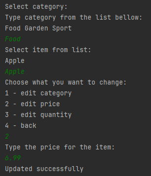

# Learn more about me 😎: [My Profile](https://github.com/AndEraneQ)

## About the project 😊:

The project relies on two main user roles: administrator and regular user. For administrators:
- functionalities include the ability to add items to the store
- manage admin privileges (add or remove admin rights)
- edit item details in the store
- manage item categories (add or remove categories)

For regular users: 
- functionalities include the option to browse the store
- manage budgets
- view purchase history
- manage personal data

## 💻 Tech Stack:
   

## Main information about project 😥.
Unfortunately, the application is console-based, but I plan to add a GUI in the future as soon as I learn it. However, this project includes Java code structures along with MySQL database connections.  

## How it works 🤪?
Firstly when we start the application we see menu:  
  
Ofcorse we can login and register. If we login it depends if our accound have admin or user permision. If admin you will need to type if you want to log in as a user or an admin.  
  
If u have user permission you dont have to type enything and you got logged on your accound.  
## So as user you have 4 options:  
1 - Go To Shop â˜‘ï¸ 
  
2 - Manage your budget â˜‘ï¸ 
  
3 - Show purchase history â˜‘ï¸ 
  
4 - Manage your data â˜‘ï¸ 
  

## As an admin you have also 4 options:  
  
1 - Add or delete somoone admin rights â˜‘ï¸ 
  
2 - Add new Item to shop â˜‘ï¸ 
  
3 - Edit items data in shop â˜‘ï¸ 
  
4 - Add or delete shopping category â˜‘ï¸ 
  

